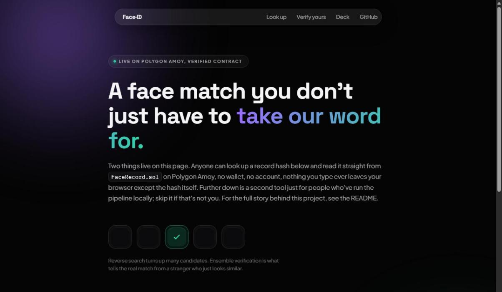
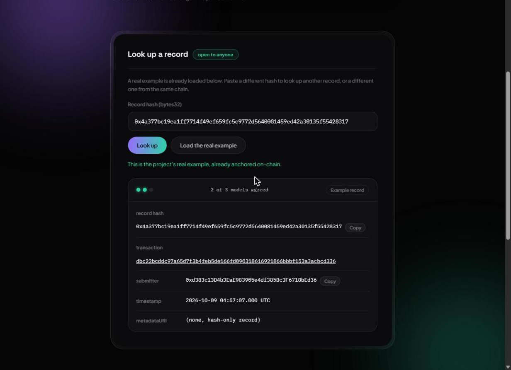
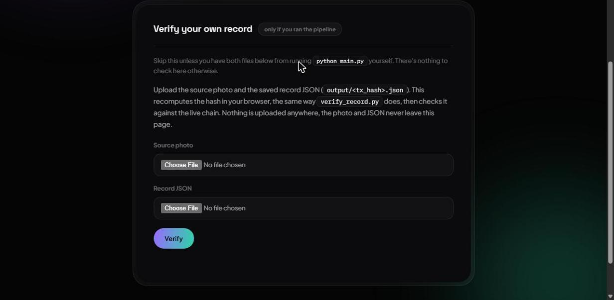
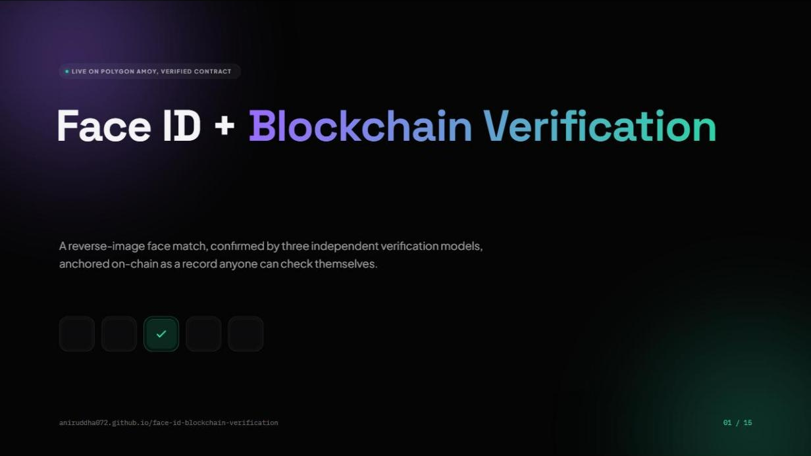
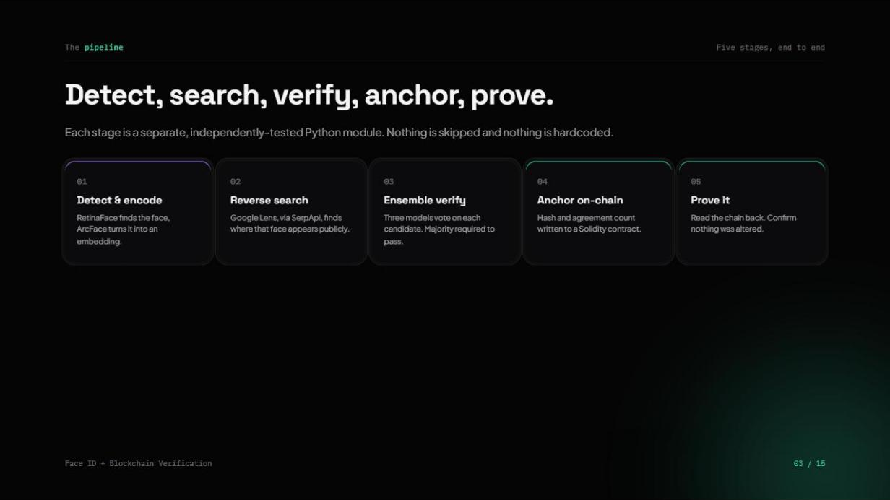

# Face ID + Blockchain Verification

A pipeline that detects a face, finds a genuine social media match through
reverse-image search, and anchors that match on-chain as a tamper-evident,
verifiable record.



**[Try the live on-chain proof viewer](https://aniruddha072.github.io/face-id-blockchain-verification/)**,
reads directly from the deployed, source-verified contract, no setup needed.
Jump straight to [looking up a record](https://aniruddha072.github.io/face-id-blockchain-verification/#lookup)
or [verifying your own pipeline output](https://aniruddha072.github.io/face-id-blockchain-verification/#verify).

**[Walkthrough deck](https://aniruddha072.github.io/face-id-blockchain-verification/presentation.html)**,
a 15-slide tour of the pipeline, the real anchored record, and the measured
accuracy, for anyone who'd rather read a summary than the full README.

<table>
<tr>
<td width="33%"></td>
<td width="33%"></td>
<td width="34%"></td>
</tr>
<tr>
<td align="center"><sub>A real record, read live from the contract</sub></td>
<td align="center"><sub>Verify your own output, entirely in-browser</sub></td>
<td align="center"><sub>The 15-slide walkthrough deck</sub></td>
</tr>
</table>

## Overview

The pipeline runs in five stages. It detects and encodes a face from an
input photo, finds where that face appears on the public web via
reverse-image search, verifies each candidate against the source photo and
ranks up to three genuine matches by confidence instead of forcing a single
guess, hashes the best match's record and writes it to a smart contract on
a public testnet, and finally reads the chain back to prove the record
hasn't been altered.

## Architecture

```
photo -> detect & encode -> reverse-image search -> verify match -> hash + anchor on-chain -> read-back proof
         (DeepFace/ArcFace)   (SerpApi Google Lens)    (DeepFace.verify)   (web3.py, Polygon Amoy)   (verify_record.py)
```



## Requirements mapping

| Requirement | How it's met |
|---|---|
| Detect and encode a face from an input image | DeepFace (RetinaFace detector + ArcFace embedding) |
| Find at least one real, matching social media post via genuine reverse-image search | SerpApi Google Lens engine, filtered to social domains, no hardcoded results |
| Upload the match's data to a blockchain for a tamper-evident, verifiable record | SHA-256 hash of the match record written to a Solidity contract on Polygon Amoy testnet, independently checkable on PolygonScan |

## Tech stack

| Layer | Pick | Why |
|---|---|---|
| Face detect + encode | DeepFace (Python), RetinaFace + ArcFace | One-line API, swappable backends, free, self-hosted |
| Reverse image search | SerpApi, Google Lens engine | Genuine Google reverse-image results, 250 free searches/month, no card |
| Match verification | `DeepFace.verify()` across 3 models (ArcFace, Facenet512, VGG-Face) per candidate, majority vote, top 3 kept and ranked by distance | One model can confidently match the wrong person; ensembling catches that, runs locally for free |
| Blockchain | Polygon Amoy testnet via Alchemy RPC + web3.py | Free, no card, ~2s finality, PolygonScan lets anyone verify independently |
| Smart contract | Minimal Solidity: `storeRecord()` + event + `getRecord()` | Gives reviewers an on-chain function to point at, not a raw calldata blob |
| Contract deployment | `deploy.py`, compiles via py-solc-x and deploys with web3.py | One command instead of a manual Remix step, same wallet key `main.py` already needs |
| Off-chain storage (optional) | Pinata (IPFS) | Keeps the full record content-addressed; skippable |
| Wallet | Burner MetaMask wallet, testnet POL only | Zero real funds ever touch this project |

## Project layout

```
main.py               run the full pipeline against one image
verify_record.py      given a tx hash, confirm the on-chain record still matches
deploy.py             compile and deploy contracts/FaceRecord.sol
contracts/
  FaceRecord.sol       the on-chain record store
src/pipeline/
  detect.py            face detection + embedding
  search.py             reverse image search (SerpApi)
  verify.py              candidate face verification
  anchor.py               record building + on-chain write
  proof.py                  on-chain read-back
  contract.py                shared Solidity compile step
  config.py                  .env loading
  retry.py                    retry-with-backoff for network calls
  exceptions.py                 typed errors for all of the above
output/                saved record JSON per run (gitignored)
```

## Setup

```bash
python -m venv venv
venv\Scripts\activate        # Windows
# source venv/bin/activate   # macOS/Linux
pip install -r requirements.txt
cp .env.example .env         # then fill in SERPAPI_KEY, ALCHEMY_AMOY_RPC_URL, WALLET_PRIVATE_KEY
python deploy.py             # deploys FaceRecord.sol, prints the address to add as CONTRACT_ADDRESS
```

## Configuration

See `.env.example`. All values required unless noted optional:

- `SERPAPI_KEY`: SerpApi key (Google Lens engine)
- `SERPER_API_KEY`: optional backup (Serper.dev, 2,500 free one-time queries)
- `ALCHEMY_AMOY_RPC_URL`: Alchemy RPC URL for the Polygon Amoy testnet app
- `WALLET_PRIVATE_KEY`: burner wallet private key, funded only via testnet faucet
- `CONTRACT_ADDRESS`: deployed `FaceRecord` contract address, from `deploy.py`
- `PINATA_JWT`: optional, only if pinning records to IPFS

## How to run

```bash
python main.py --image photo.jpg
```

Runs the full pipeline and saves the result to `output/<tx_hash>.json`. To
independently confirm a past run still matches what's on-chain:

```bash
python verify_record.py --tx <tx_hash>
```

## Match confidence

Reverse-image search can find visually similar strangers, not just the
actual subject, especially when a face isn't heavily reposted or tagged
online. A single embedding model can confidently match the wrong person,
confirmed by a real test run where `ArcFace` alone passed a stranger's
photo under its own threshold. Two defenses against that:

- **Ensemble verification.** Every candidate is checked against 3
  independent models (ArcFace, Facenet512, VGG-Face). A candidate only
  counts as genuinely verified if a majority agree, not just one. Ranking
  still uses ArcFace's distance (the primary signal), the agreement count
  travels alongside it.
- **Ranked, not forced.** `verify_candidates()` returns up to the 3
  highest-confidence verified matches instead of a single automated guess,
  and `main.py` prints all of them, so a weak match is visibly weak instead
  of looking identical to a strong one.

The agreement count (how many of the 3 models confirmed the match) is
anchored on-chain alongside the record hash, in `FaceRecord.sol`'s
`modelsAgreed` / `modelsTotal` fields, not just kept in local output. The
[on-chain proof viewer](https://aniruddha072.github.io/face-id-blockchain-verification/)
shows it for any anchored record.

## Measured accuracy

`benchmark_ensemble.py` measures the ensemble against
[LFW's labeled pairs](https://vis-www.cs.umass.edu/lfw/) (known same-person
and different-person photo pairs), entirely offline, no reverse-image
search or blockchain involved:

```bash
pip install scikit-learn   # only needed for this benchmark, not the pipeline
python benchmark_ensemble.py --per-class 50
```

On a 100-pair sample (50 same-person, 50 different-person):

```
true positive rate:  92.0%  (46/50 genuine matches correctly verified)
false positive rate: 2.0%  (1/49 different people incorrectly verified)
skipped (face not detected): 1

model agreement distribution:
same-person pairs:       0/3=1, 1/3=3, 2/3=8, 3/3=38
different-person pairs:  0/3=46, 1/3=2, 2/3=1
```

Both error cases were manually checked against the actual photos. The one
false positive is two different men who are genuinely similar-looking
(age, mustache, skin tone, build), a believable mistake, not a data
error. The hardest false negative is the same woman photographed at a
very different angle, lighting, and apparent age, a legitimately hard
pair, not a labeling error.

An earlier 30-pair run reported 100% TPR / 0% FPR. That sample was too
small to catch anything: with zero observed errors in 15 trials, the
true error rate could plausibly be as high as 15-20% by chance alone
(the standard "rule of three" bound for zero-event samples). 100 pairs
is still not a formal benchmark, but it's large enough to have actually
found both a real false positive and a real false negative, which is
more convincing than a suspiciously perfect small sample. Worth being
upfront about one more thing: ArcFace, Facenet, and VGG-Face were
historically developed and tuned against LFW by their original authors,
so strong LFW performance is partly expected rather than fully
independent evidence of real-world accuracy on the messier photos this
pipeline actually processes (compressed thumbnails, odd crops, social
media compression). This benchmark confirms the ensemble logic itself
works correctly and the 2-of-3 pattern is real, not that the pipeline
will hit 92%/2% on arbitrary internet photos.

## Example output

Real run against a real photo, `python main.py --image photo.jpg`:

```
detected face: confidence=1.000 bbox={'x': 728, 'y': 292, 'w': 398, 'h': 476}
reverse search: 21 social-media candidate(s)
verified 3 candidate(s) as genuine matches:
  [1] https://www.youtube.com/shorts/DzrJ_RFvIkM (platform=youtube.com, distance=0.5836, models agreed=2/3) (anchoring this one)
  [2] https://m.facebook.com/rahulbasakofficial/videos/... (platform=facebook.com, distance=0.6123, models agreed=2/3)
  [3] https://www.instagram.com/p/Cxh41WGMCIV/ (platform=instagram.com, distance=0.6125, models agreed=2/3)
anchored on-chain: tx dbc22bcddc97a65d7f3b4feb5de166fd090318616921866bbbf153a3acbcd336
view proof: https://amoy.polygonscan.com/tx/dbc22bcddc97a65d7f3b4feb5de166fd090318616921866bbbf153a3acbcd336
saved record to output/dbc22bcddc97a65d7f3b4feb5de166fd090318616921866bbbf153a3acbcd336.json
```

[View this transaction on PolygonScan](https://amoy.polygonscan.com/tx/dbc22bcddc97a65d7f3b4feb5de166fd090318616921866bbbf153a3acbcd336)

## Blockchain choice

Polygon Amoy testnet, accessed via an Alchemy RPC endpoint. Chosen because it
has a genuine no-card free tier, roughly 2 second block finality, full
Solidity support, and PolygonScan gives anyone an independent way to verify
the on-chain record without trusting this repo's output.

The deployed contract's source is verified on PolygonScan (exact match):
[0x98D363d1b816FAc6a034bE3237fA20bcCbbC2c99](https://amoy.polygonscan.com/address/0x98D363d1b816FAc6a034bE3237fA20bcCbbC2c99#code).
Anyone can read the actual Solidity source there and call `getRecord()`
directly from the "Read Contract" tab, no wallet required.

## Known limitations

- Search coverage is limited to what the search engine has indexed, it
  won't find everything, especially recent or private posts.
- Match accuracy depends on the embedding model and the input photo's
  quality (angle, lighting, occlusion).
- The blockchain proves the record's hash existed at a specific block and
  time. It's a tamper-evident timestamp of the claim, not proof the matched
  content itself is authentic.
- No liveness or deepfake detection on the input photo.
- Run only with consenting subjects. Face search tools' terms of service
  restrict use for employment, credit, insurance, or tenant-screening
  decisions.
- This project runs on a public **testnet** (Polygon Amoy), not mainnet, so
  no real funds or mainnet gas are involved.
- Subject to the search API's rate limits and free-tier cap (SerpApi: 250
  searches/month; Serper.dev fallback: 2,500 one-time queries).
- SerpApi's image upload caps the source photo at 500 KB; larger files are
  rejected outright rather than silently resized.

## Consent / ethics note

This pipeline is run only against consenting subjects with a real, findable
public social presence. It is not intended, and should not be used, for
employment, credit, insurance, tenant-screening, or any other decision about
a person without their knowledge and consent.

## License

[MIT](LICENSE)
